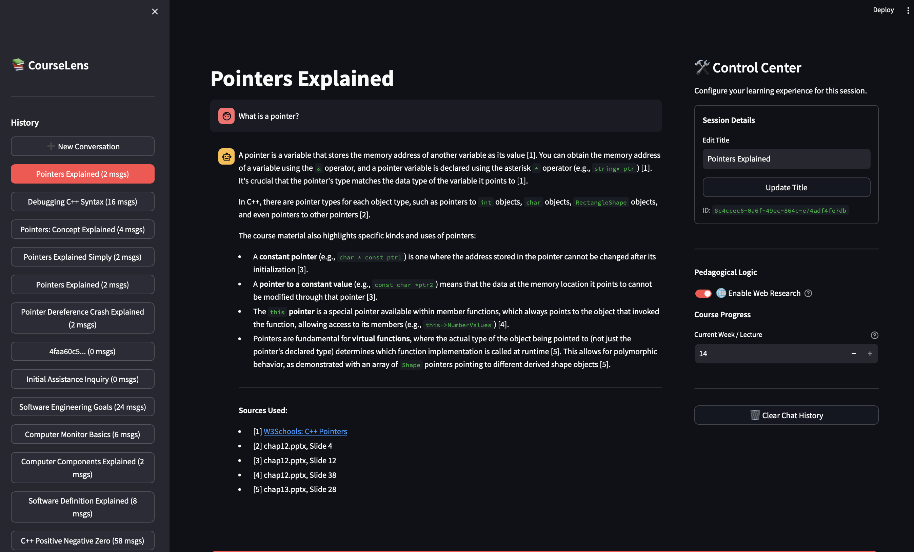

# 📚 CourseLens: A Socratic AI Tutor for Active Learning


CourseLens is a high-quality AI tutoring system designed to turn passive reading into active learning. Unlike standard chatbots, CourseLens is built to prioritize teaching accuracy, grounding every interaction in provided lecture materials while using advanced AI patterns to manage context and relevancy.

---

## 💡 The Core Framework: GRASP

CourseLens uses the **GRASP** framework to move students from just "reading" to actually "grasping" concepts.

*   **Gradual**: Adapts how much information it gives based on student progress.
*   **Reflective**: Provides automated "Journey Recaps" to summarize what has been learned.
*   **Affirming**: Uses positive reinforcement for breakthroughs in understanding.
*   **Socratic**: Uses a multi-stage system that guides students via hints rather than giving direct answers.
*   **Patient**: Stays in the teaching mode even when students are looking for a quick fix.

---

## 🛠️ Engineering Advantages

CourseLens is built to solve common AI challenges, ensuring the system remains fast, accurate, and faithful to the course curriculum.

### 1. Avoiding "Context Bloat"
Standard AI systems often get confused in long conversations when old, irrelevant messages clutter the memory. CourseLens solves this in two ways:
*   **Temporary Socratic History**: A specialized context window for tutoring that clears once a concept is mastered.
*   **Summarized Memory**: A `SummarizationEngine` that condenses the long conversation history into core facts, keeping code snippets exactly as they were without the extra "noise."

### 2. High-Accuracy Grounding (Hybrid Search)
To ensure the tutor always uses the most relevant lecture material, we use a **Hybrid Search** strategy:
*   **Semantic Search**: Finds the general meaning of a question.
*   **Keyword Search (BM25)**: Ensures exact matches for technical C++ terms like specific operators or functions.
*   **Material Priority**: The system explicitly ranks **Professor-Provided Slides** higher than web-scraped content to ensure the core learning comes from the official curriculum first.

### 3. Curriculum Controls & Filtering
*   **Week-Based Filtering**: Metadata filters ensure the AI doesn't talk about future concepts that haven't been taught yet in the syllabus.
*   **Topic-Based Filtration**: Automatically picks out topics from a student's question to search the knowledge base more precisely.

### 4. Dual-Model Logic
CourseLens uses a two-model pattern to keep things efficient:
*   **Assessor (Small Model)**: Quickly classifies what the student is asking and checks if their answers are "Correct" or a "Misconception."
*   **Generator (Main Model)**: Focuses on writing clear, helpful teaching responses based on the assessor's logic and the lecture materials.

---

## 📸 Technical Showcase

### The Socratic Engine in Action
The system identifies the student's stage of learning and provides hints grounded in the slides.


### Multi-Source Web Scraping
When course materials are too brief, the system intelligently pulls in extra detail from trusted sites (GFG, LearnCpp).


### Visual RAG & Image Retrieval
The system automatically pulls in and shows relevant diagrams from the lecture slides.


---

## 🚀 Setup & Run

1. **Install Dependencies**:
   ```bash
   pip install -r requirements.txt
   ```
2. **Start the API**:
   ```bash
   python api.py
   ```
3. **Open the UI**:
   ```bash
   streamlit run ui.py
   ```

---

*Developed by [Sharan Giri](https://www.linkedin.com/in/sharan-giri/) & [Jyothssena Gomatum Sreenivaasan](https://www.linkedin.com/in/gsjyothssena/). We focus on building goal-oriented AI systems that do more than just process text.*

---
*Developed for DS5500: Special Topics in Data Science.*
